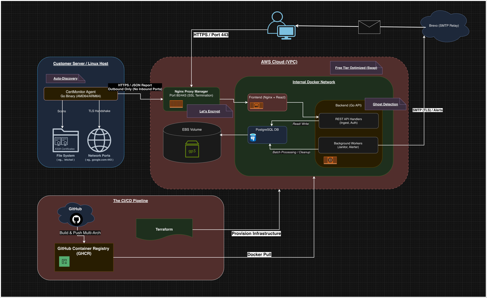

# **CertMonitor Platform**

**Total Visibility for Your TLS Infrastructure.**

**Built for Cloud, Edge, and On-Premise.**

CertMonitor is a hybrid SSL/TLS monitoring platform that combines **Agent-based discovery** for internal networks with **Agentless Cloud Monitoring** for public endpoints. Whether you manage a single VPS, a Kubernetes cluster, or a fleet of IoT devices, CertMonitor gives you a single pane of glass for every certificate you own.

## 🌐 Live Demo

🚀 **Deployed on AWS:** Try out the platform here:  
👉 **[https://certmonitor.systems](https://certmonitor.systems)**

## **🚀 Features**

### **Hybrid Monitoring**
* **Agent-Based Discovery:** A lightweight Go binary scans `/etc/ssl`, `/var/www`, and internal ports (e.g., `localhost:8443`) to find certificates behind firewalls.
* **Agentless Cloud Monitors:** Remotely scan any public URL or IP address (e.g., `google.com`) without installing any software.

### **Intelligent Inventory**
* **Auto-IP Detection:** Agents automatically report their Public IP (via Nginx headers), making it easy to identify servers in dynamic environments.
* **Ghost Detection:** Automatically flags certificates that have disappeared from a server ("Soft Delete").
* **Real-Time Status:** Live heartbeat tracking to detect offline agents immediately.

### **Security First**
* **Zero-Touch Architecture:** The agent **only** reads Public Certificates (`.crt`). It never accesses, reads, or transmits TLS Private Keys.
* **Hashed Agent Authentication:** Agents use a unique API Key for ingestion. The backend only stores cryptographically hashed versions of these keys, ensuring that even a database leak does not compromise your agents.
* **Outbound Only:** Agents push data to the backend via HTTPS. No inbound firewall ports need to be opened.

### **Enterprise Ready**
* **Smart Alerting:** Deduplicated email alerts via SMTP (Brevo/SendGrid) for expiring certs.
* **Infrastructure as Code:** Fully automated AWS deployment via Terraform.
* **Secure Auth:** JWT-based authentication with secure API Key management.
* **Multi-Architecture Support:** Docker images and Agent binaries are cross-compiled for both amd64 (Intel/AMD) and arm64 (AWS Graviton, Raspberry Pi, Apple Silicon).

## **🏗 Architecture**

CertMonitor runs as a **4-Container Docker Cluster** orchestrated via Docker Compose:

1.  **Nginx Proxy Manager (Gateway):**
    * The only entry point (Ports 80/443).
    * Handles **SSL Termination** (Let's Encrypt) and auto-renewal.
    * Proxies traffic to the Frontend.
2.  **Frontend (Nginx + React):**
    * Serves the UI and acts as an internal Reverse Proxy for API requests.
    * **Resilient Networking:** Uses dynamic DNS resolution (Docker resolver) to automatically handle container restarts and IP changes without downtime.
3.  **Backend (Go):**
    * REST API listening internally. Handles ingestion, auth, and background workers.
    * **Cloud Worker:** Runs background routines to scan public "Cloud Monitor" targets.
4.  **Database (PostgreSQL):**
    * Persistent storage for users, agents, and certificate data.

### 📊 Architecture Diagram

## **☁️ Deployment Option A: Automated (Terraform)**

**Recommended.** Deploys a production-ready server on **AWS Free Tier (t3.micro)** in minutes.

### **Prerequisites**

* AWS CLI configured.  
* Terraform installed (brew install terraform).

### **1\. Setup Secrets**

Navigate to the infrastructure folder and create your secrets file:

cd infra  
nano secrets.tfvars

**Paste and fill:**

db\_password  \= "strong\_db\_password"  
jwt\_secret   \= "long\_random\_string"  
smtp\_user    \= "your\_brevo\_email"  
smtp\_pass    \= "your\_brevo\_smtp\_key"  
smtp\_sender  \= "alerts@yourdomain.com"

### **2\. Deploy**

terraform init  
terraform apply \-var-file="secrets.tfvars"

**What this does:**

1. Provisions an EC2 Instance (Ubuntu 24.04).  
2. Allocates and attaches a Static IP (Elastic IP).  
3. Configures Security Groups (Firewall).  
4. **Auto-Bootstraps:** Installs Docker, pulls images from GHCR, and starts the stack.

## **🐳 Deployment Option B: Manual (Any VPS)**

Use this for DigitalOcean, Hetzner, or local testing.

### **1\. Clone & Config**

git clone \[https://github.com/shubhamsharanofficial-pixel/CertMonitor-Platform.git\](https://github.com/shubhamsharanofficial-pixel/CertMonitor-Platform.git)  
cd cert-monitor-platform

Create a .env file in the root:

DB\_PASSWORD=secure\_pass  
JWT\_SECRET=random\_string  
SMTP\_HOST=smtp-relay.brevo.com  
SMTP\_PORT=587  
SMTP\_USER=brevo\_email  
SMTP\_PASS=brevo\_key  
SMTP\_SENDER=alerts@domain.com  
FRONTEND\_URL=http://YOUR\_SERVER\_IP

### **2\. Run (Image Based)**

This pulls pre-compiled images from the registry. No build tools required.

\# Rename the production compose file  
cp docker-compose.prod.yml docker-compose.yml

\# Start  
docker compose up \-d

## **🔒 Post-Deployment: Enable SSL**

Once your server is running (Option A or B):

1. **Point your Domain:** Create an A-Record (DNS) pointing your-domain.com to your Server IP.  
2. **Access Admin Panel:** Open http://YOUR\_IP:81.  
   * Default: admin@example.com / changeme  
3. **Create Proxy Host:**  
   * Domain: your-domain.com  
   * Forward Hostname: cert\_frontend  
   * Forward Port: 80  
   * **SSL Tab:** Request a new Let's Encrypt Certificate.

## **📦 Agent Installation**

### **Option A: Auto-Install Script (Recommended)**

1. Log in to the Dashboard.  
2. Click **"Generate API Key"** (or Rotate Key) in the top navigation bar.  
3. Copy the provided curl or wget command.  
4. Run it on your server. The script automatically detects your OS and CPU architecture, downloads the correct binary, and installs it as a systemd service (Linux).

### **Option B: Manual Binary**

1. Log in to your new Dashboard and go to the **Downloads** page.  
2. Download the binary for your OS (Linux/macOS).  
3. Download the config.yaml template and add your API Key.  
4. Run it:  
   ./agent-linux-amd64 \-config config.yaml

### **Option C: Docker (Containerized)**

1. Download docker-compose.agent.yml and config.yaml from the **Downloads** page.  
2. Edit config.yaml:  
   * Add your API Key.  
   * **Important:** Update paths to match container mounts (e.g., set state\_path: "/app/data").  
3. Run the container:  
   docker compose \-f docker-compose.agent.yml up \-d

## **📫 Contact & Support**

I am open to feedback, bug reports, and feature requests!

* **👤 Developer:** Shubham Sharan
* **📧 Email:** [shubhamsharanofficial@gmail.com](mailto:shubhamsharanofficial@gmail.com)
* **🔗 LinkedIn:** [shubham-sharan](https://www.linkedin.com/in/shubham-sharan-56765b226)
* **💻 GitHub:** [shubhamsharanofficial-pixel](https://github.com/shubhamsharanofficial-pixel)

## **🔧 Development (Local)**

To contribute to the code:

**Backend:**

cd backend  
go run cmd/server/main.go

**Frontend:**

cd frontend  
npm install  
npm run dev

## **📄 License**

**Source Available.**

This project is licensed under the **PolyForm Noncommercial License 1.0.0**.

* **✅ Free for Personal Use:** You are free to use, modify, and run this software for personal, educational, or non-profit purposes.
* **❌ Commercial Use Prohibited:** You may NOT use this software for business purposes, including monitoring company infrastructure or offering it as a service.

**💼 Want to use this for your business?** Please contact me via [email](mailto:shubhamsharanofficial@gmail.com) for a commercial license.

---
